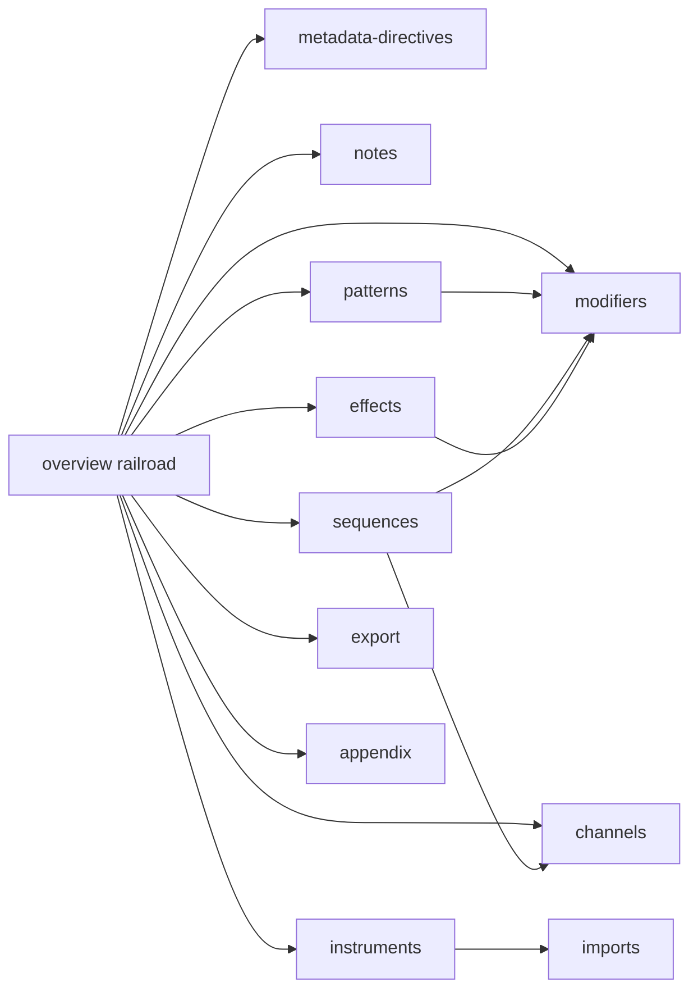

# Complete Language Reference with Navigable Grammar Map

## Defaults (locked)

- **Source of truth:** [kadraman/beatbax@main](https://github.com/kadraman/beatbax) — `packages/engine/src/parser/peggy/grammar.peggy`, `…/index.ts`, `packages/engine/scripts/generate-peggy-parser.cjs`, plus tests/examples under `packages/engine/tests/`** and `songs/`**. Docs already depend on `@beatbax/engine@^0.22.2`, matching main.
- **Diagram tech:** Custom React “railroad map” component (SVG/HTML boxes + tracks), clickable via `@docusaurus/Link`. Classic railroad look, full control over navigation targets, no Mermaid plugin. Not a raw PEG dump.

During implementation, fetch/clone the main repo as a read-only reference (sibling clone preferred if shell works; otherwise continue from GitHub raw + npm package).

## Grammar coverage map (confirmed on main)

Top-level `Statement` alternatives from `grammar.peggy`:


| Grammar rule                                                                                    | Docs action                                                                                                                      |
| ----------------------------------------------------------------------------------------------- | -------------------------------------------------------------------------------------------------------------------------------- |
| `ChipStmt`, `BpmStmt`, `VolumeStmt`, `StepsPerBarStmt`, `ScaleStmt`, `SongMetaStmt`, `PlayStmt` | Keep/expand `[metadata-directives.mdx](docs/language/metadata-directives.mdx)`                                                   |
| `TimeStmt`, `TicksPerStepStmt`                                                                  | Document as **deprecated** (parser warns; `time` aliases `stepsPerBar`; `ticksPerStep` has no effect)                            |
| `ImportStmt`                                                                                    | Keep `[imports.mdx](docs/language/imports.mdx)`                                                                                  |
| `InstStmt`, macros, note mapping, `SubPatStmt`                                                  | Keep instruments cluster; strengthen `subpat` cross-links                                                                        |
| `EffectStmt` + inline `<…>`                                                                     | Keep `[effects.mdx](docs/language/effects.mdx)`; add missing builtins `**bend**`, `**sweep**` (in parser `BUILTIN_EFFECT_NAMES`) |
| `PatStmt` / `PatShorthandStmt`, pattern atoms                                                   | **New** pages                                                                                                                    |
| `SeqStmt` + `SeqModifier`                                                                       | **New** sequences page; keep `[modifiers.mdx](docs/language/modifiers.mdx)`                                                      |
| `ChannelStmt` (`inst` / `pat` / `seq`, `speed=`, `lock=`)                                       | **New** channels page                                                                                                            |
| `ExportStmt`                                                                                    | **New** short page (syntax only; deep format docs stay under Export Plugins)                                                     |
| Comments `#` / `//`                                                                             | Cover in overview + metadata                                                                                                     |


**Out of scope / not on main grammar:** `alias` / `section` / `form` / `include` / `cat` (mentioned in older design notes only — do not document as current syntax).

## Target IA and navigation

Update `[sidebars.ts](sidebars.ts)` Language Reference to:

```
Language Reference
├── overview          ← NEW hub + railroad map (category landing)
├── metadata-directives
├── notes             ← NEW
├── patterns          ← NEW
├── sequences         ← NEW
├── channels          ← NEW
├── Instruments (existing nest)
│   ├── instruments
│   ├── instrument-macros
│   ├── instrument-note-mapping
│   └── imports
├── modifiers
├── effects
├── export            ← NEW (in-file `export fmt "path"`)
└── appendix          ← NEW statement/token index
```

Keep unlisted redirects `[scale.md](docs/language/scale.md)` / `[volume-directive.md](docs/language/volume-directive.md)`.

Wire category landing: set Language Reference category `link` to `language/overview` (sidebar + `_category_.json` if needed).




## Railroad hub component

Add `[src/components/GrammarRailroad/](src/components/GrammarRailroad/)`:

- Presentational railroad panels for: **Program / Statement**, **Pattern RHS**, **Sequence RHS**, **Channel RHS**, **Pattern atom**.
- Each nonterminal or statement keyword is a link to the matching doc (`/docs/language/...`).
- Compact legend + short prose: “boxes are clickable topics.”
- Register in `[src/theme/MDXComponents.tsx](src/theme/MDXComponents.tsx)`.
- Style with CSS modules aligned to existing docs chrome (readable light theme; avoid purple-glow / card clutter).
- Diagram data driven from a small typed map (rule → doc id) so links stay maintainable.

Embed on `[docs/language/overview.mdx](docs/language/overview.mdx)` as the first viewport after a one-paragraph intro of song shape.

## Page work (preserve + fill)

### New pages (lift from tutorial; reference tone)

1. `**overview.mdx**` — song anatomy, statement order intuition, railroad, links to tutorial walkthrough.
2. `**notes.mdx**` — pitches (`A-G` + `#`/`b` + octave), duration `:N`/`/N`, rests `.` `_` `-`, from grammar `NoteToken` / `RestToken` / `DurationSuffix`; demos via BaxPlayer; link [Tutorial — Notes](/docs/tutorial/notes).
3. `**patterns.mdx**` — `pat name = …`, shorthand `name = …`, groups `(…)*N`, `inst(name[,N])`, inline `inst name`, quoted token lists, effect suffixes; link sequencing tutorial.
4. `**sequences.mdx**` — `seq`, refs, `*N`, groups, empty-seq error; pointer to modifiers.
5. `**channels.mdx**` — `channel N => inst … seq|pat …`, `speed=`, `lock=`, rejection of channel `bpm`; chip voice numbering pointer to chip pages.
6. `**export.mdx**` — `export <format> "<path>"` only; See also Export Plugins.
7. `**appendix.mdx**` — compact statement table (all grammar stmts), lexical notes (identifiers, strings, comments), reserved words, deprecated directives.

### Update existing

- `**[metadata-directives.mdx](docs/language/metadata-directives.mdx)`:** fix `song author` → `song artist` in example; add `time` / `ticksPerStep` deprecated callouts; wire unused `stepsPerBarBax` demo; ensure `chip` region form documented if confirmed by tests.
- `**[effects.mdx](docs/language/effects.mdx)`:** add `bend` and `sweep` sections only after confirming parameter shapes from engine effect handlers / tests / UGE docs (already referenced in exports); do not invent params.
- `**[modifiers.mdx](docs/language/modifiers.mdx)`:** light cross-links from new seq/pat pages; fill any catalog rows that lack examples only when tests supply valid syntax.
- **Instruments / macros / imports:** reconcile against main `docs/grammar/`* and tests; keep chip-specific detail on chip pages.
- **Tutorial pages:** add “See also” links to the new language-ref counterparts (do not gut tutorial narrative).

### Demos

Extend `[src/components/BaxPlayer/demos/languageRef.ts](src/components/BaxPlayer/demos/languageRef.ts)` with parser-valid snippets for notes, pat/seq/channel basics, deprecated directives (warning-only, optional), and bend/sweep once params are confirmed. Prefer short Game Boy demos consistent with existing languageRef style.

## Reconciliation workflow (implementation order)

1. Snapshot main grammar + parser semantic rules + key tests (modifiers list, effects builtins, channel RHS).
2. Build railroad component + overview hub.
3. Add missing pages with examples taken from tests/`songs/**`/tutorial (validated against grammar).
4. Patch existing pages for stale bits (`song author`, missing builtins, deprecations).
5. Update `sidebars.ts` + cross-links.
6. Final checklist: every `Statement` alternative covered; no undocumented invented syntax; site builds (`npm run build`).

## Explicit non-goals

- Dumping full `.peggy` source into docs.
- Documenting planned-but-absent constructs (`section`/`form`/`alias`).
- Redesigning chip/export plugin docs (only link into them).
- Replacing BaxPlayer demos with diagrams.

